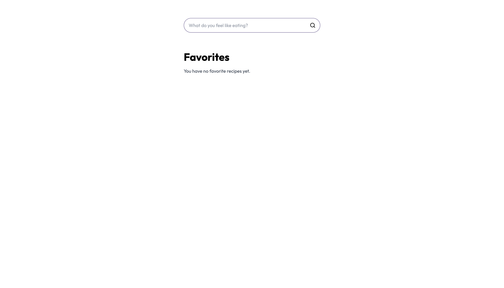
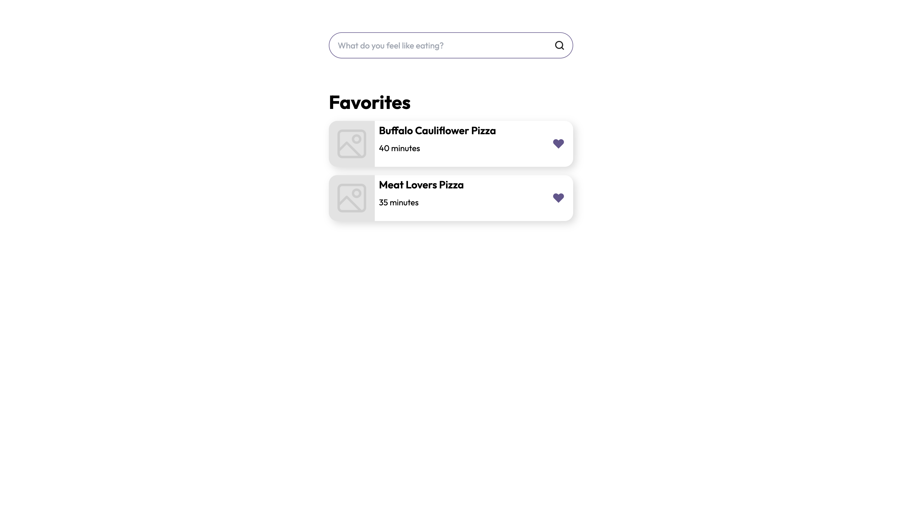
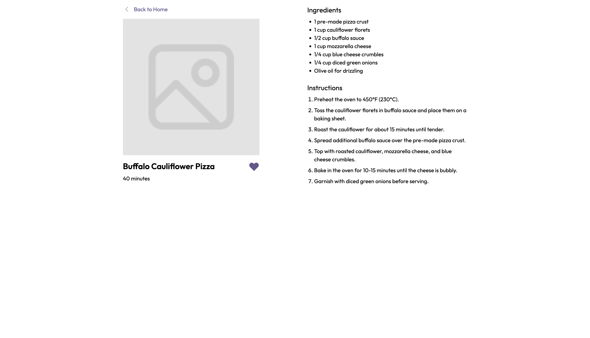

# TasteAI

## Overview

**TasteAI** is a smart recipe recommendation platform designed to provide users with tailored meal suggestions based on their preferences and
dislikes. The application uses OpenAI’s GPT model to generate personalized recipes while allowing users to track their favorite recipes and exclude
disliked options from future recommendations. TasteAI aims to enhance the cooking experience by offering a seamless interface for exploring a wide
variety of recipes.

## Table of Contents

- [Overview](#overview)
- [Preview](#preview)
- [Getting Started](#getting-started)
    - [Prerequisites](#prerequisites)
    - [Installation](#installation)
    - [Start in Development Mode](#start-in-development-mode)
- [Features](#features)
- [Client Setup](#client-setup)
- [License](#license)

## Preview

Below are some previews of the TasteAI platform, showcasing its user interface and diverse features. These images demonstrate the intuitive design and
functionality of the platform, highlighting its potential to revolutionize the cooking experience.


*The home page provides an engaging entry point to the platform, featuring the user's favorite recipes.*


*The favorites section displays all the recipes the user has marked as favorites, allowing for easy access and organization.*


*The recipe page displays detailed information about each dish, including ingredients and preparation steps.*

## Getting Started

### Prerequisites

- [Bun](https://bun.sh/)
- [Docker](https://www.docker.com/)
- [Docker Compose](https://docs.docker.com/compose/)

### Installation

1. Clone the repository:
    - SSH:
      ```bash
      git clone git@github.com:edwardinio18/TasteAI.git
      ```
    - HTTPS:
      ```bash
      git clone https://github.com/edwardinio18/TasteAI.git
      ```

2. Navigate to the project directory:
    ```bash
    cd TasteAI
    ```

### Start in Development Mode

To start the application in development mode, follow these steps:

1. Install the necessary dependencies:
    ```bash
    bun install; cd client; bun install; cd ..
    ```

2. Launch the Docker containers:
    ```bash
    docker-compose up -d
    ```

3. Access the client application at `http://localhost:3000`.

## Features

### Recipe Search

Users can enter a description of what they feel like eating, and TasteAI will generate a list of tailored recipe suggestions. Users can explore
different recipes based on their preferences, and the app will filter out disliked recipes in future recommendations.

### Favorites

Recipes can be added to the user's favorites list for easy access later. The Favorites Page keeps track of all the recipes the user has marked as
favorites, offering a personalized recipe book.

### Dislike and Exclude Recipes

The app allows users to dislike recipes, and those disliked recipes will be excluded from future search results for the same query. The disliked
titles are stored locally and prevent the same recipes from appearing multiple times.

## Technologies Used

### The project incorporates the following technologies:

**React**: A JavaScript library for building the user interface. React powers the component-based architecture of the app.\
**TypeScript**: The app is written in TypeScript, providing static typing to enhance code quality and maintainability.\
**Tailwind CSS**: Tailwind is used for styling the application. It allows for rapid UI development with utility classes.\
**OpenAI GPT-4o mini**: The application uses GPT-4 to generate recipe suggestions based on user input, providing personalized meal ideas.\
**ESLint and Prettier**: These tools ensure consistent code quality and formatting across the project.\
**Husky & lint-staged**: To manage pre-commit hooks and ensure code is properly linted and formatted before being pushed.\
**Vite**: The development server is powered by Vite, providing fast build times and a smooth developer experience.\
**Bun**: Used as the JavaScript runtime, offering improved performance over Node.js for tasks like bundling, transpiling, and package
management, leading to faster development workflows.

## Client Setup

To configure the client and get it running, ensure that your `.env` file contains the necessary environment variables:

`VITE_OPENAI_API_KEY`: Your OpenAI API key for fetching personalized recipe suggestions. For example:

```bash
VITE_OPENAI_API_KEY=your_openai_api_key
```

## License

This project is licensed under the MIT License. See the [LICENSE](LICENSE) file for more details.

The MIT License is a permissive free software license that allows anyone to use, modify, distribute, and even sublicense the software with very few
restrictions. This ensures that TasteAI remains open and accessible to developers and users alike, encouraging innovation and collaboration within the
community while limiting liability for contributors.